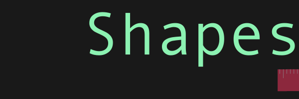

Commonly used shapes for SwiftUI, some I found on the web [swiftui-lab](https://swiftui-lab.com) and [objc.io](https://www.objc.io/blog/2019/12/16/drawing-trees), others I made myself.
I hope to create community based repo for cool animated shapes, paths, etc. If you would like to submit some of your own shapes just make a pull request and I will try to approve it ASAP. If you want to try out this package just clone the [example project](https://github.com/kieranb662/Shapes-Examples)

If you have an idea for a shape but don't know how to describe it, try out the `PathEditor` tool that comes packaged with [bez](https://github.com/kieranb662/bez)

- **AnyShape**: A type erased `Shape`

- **Lines**
    - `Line`
    - `HorizontalLine`
    - `VerticalLine`
    - `AdaptiveLine`

- **Triangles**
    - `Triangle`
    - `OpenTriangle`
    - `RightTriangle`

- **Graphing**
    - `CartesianGrid`
    - `TickMarks`
    - `PolarGrid`
    - `RadialTickMarks`

- **Misc**
    - `InfinitySymbol`
    - `Arrow`
    - `Polygon`
    - `Pentagon`
    - `PathText`
    - `FoldableShape`

## Lines

### Line

Found at [drawing trees](https://www.objc.io/blog/2019/12/16/drawing-trees). A Line defined by the from and to points.

### Horizontal
A horizontal line that is the width of its container has a single parameter
`offset`: A value between 0 and 1 defining the lines vertical offset in its container (**Default**: 0.5)

### Vertical

A Vertical line that is the height of its container has a single parameter
`offset`: A value between 0 and 1 defining the line's horizontal offset in its container (**Default**: 0.5)

### Adaptive

This shape creates a line centered inside of and constrained by its bounding box.
The end points of the line are the points of intersection of an infinitely long angled line and the container rectangle

## Triangles

The various triangles are shown below.

## Graphing

### Cartesian Grid

A Rectangular grid of vertical and horizontal lines. Has two parameters
`xCount`: The number of vertical lines
`yCount`: The number of horizontal lines

### Polar Grid

A grid made up of concentric circles and angled lines running through their center.
`rCount`: The number of Circles
`thetaCount`: The number of lines

### TickMarks

Tick marks spaced out evenly with varying lengths dependent on the type of tick
minor, semi, or major.

The shape has two parameters `spacing: CGFloat` and `ticks: Int`. The spacing is the distance between ticks while the `ticks` is the number of tick marks.

An examples using `TickMarks` are shown below

## Misc

## Arrow

An arrow that starts out small shaped like this |--| but as it grows larger it looks like this <---->

## Pentagon

## Foldable Shapes

